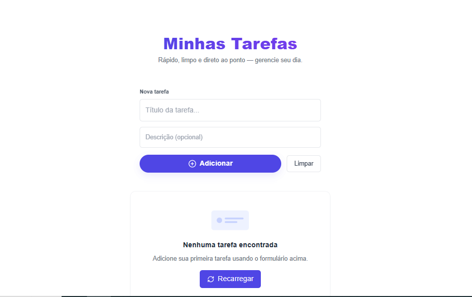

# 🚀 Todo List Full Stack


> **Onde a eficiência encontra a elegância.** Um gerenciador de tarefas completo, integrando a robustez do Java Spring Boot com a interatividade do React.

---

## Preview do Projeto


---

## 📋 Guia de Execução

Siga este guia para rodar a aplicação localmente e ver a mágica acontecer.

### 🛠 Pré-requisitos
Antes de começar, garanta que sua máquina tenha:
- [x] **Java JDK 17** ou superior.
- [x] **Node.js** (v18+ recomendado).
- [x] **Maven** (Opcional se usar IDEs com suporte nativo).

---

## 🧠 Passo 1: Iniciar o Back-end (O Cérebro)

O servidor Java precisa rodar primeiro para gerenciar o banco de dados e as requisições.

1. Abra o terminal na raiz do projeto e entre na pasta do backend:
```bash
cd backend